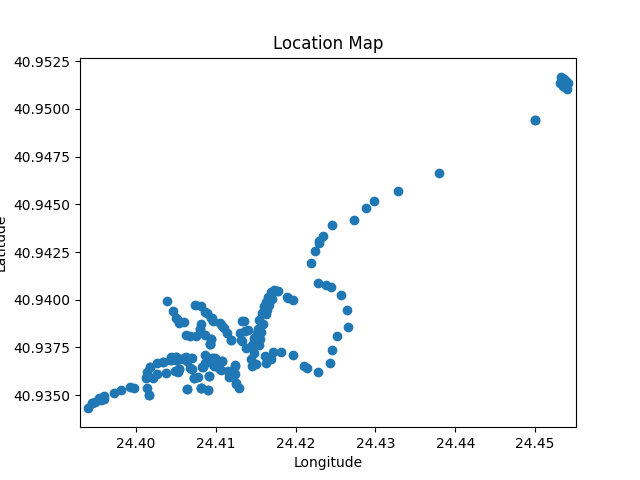
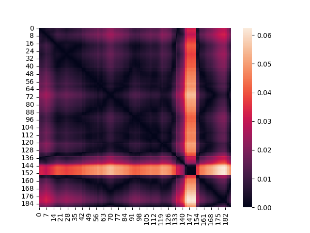
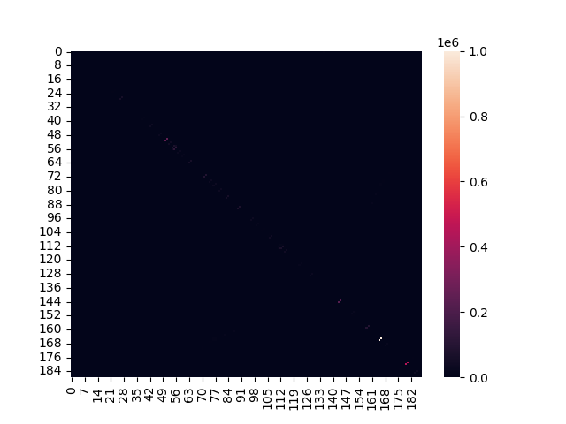
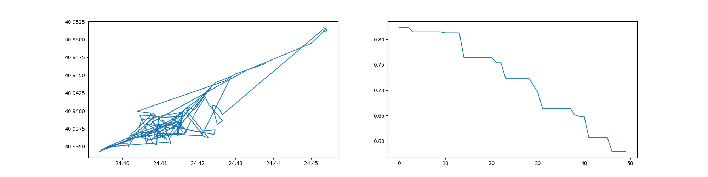

# Optimization Algorithms Assignment

Repository to store my university assignment for the "optimization algorithms" class.

## Assignment:

Given a map in .kml format with the locations of trash cans of a given area, find the optimal path to visit all trash cans in the least possible travel distance (ignore any real life variables, besides the euclidean distance of the trash cans).

---

*This is a “traveling salesman” problem. “Ant Colony” is a good algorithm to solve such problems. Thus, this is the algorithm we choose.*

## Instructions:

1. Rename any .kml file to "locations.kml".
2. Run ants.py.

For better paths change `num_iter= ...` at line 71 of `ants.py` to a bigger number. The bigger the better, but it will take a lot of time and resources to compute!

The program outputs all the locations in the "locations.csv" and the best path it fount in path.csv

## Example:

Heat map

Best path map:

## Acknowledgments:

Ant Colony algorithm was provided by the teacher.
